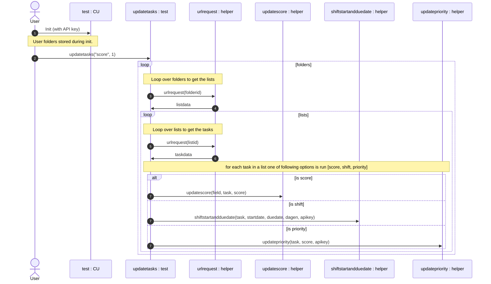

# ClikUpShift


ClickUp is a cloud based project management / ToDo environment. (url: https://clickup.com/?noRedirect=true). 

This Python package adds some functionality that is currently not present. 

It allows you to: 
> * shift tasks (by a number of days),
> * score tasks (by using 4 custom fields), 
> * based on the score give them a priority. 
 

Reference to those custom fields have been hard coded. Therefore, scoring will not work out of the box, shifting tasks should work.

When you add the following fields the code could work, although the field references have been [hard coded](https://github.com/stevedep/ClickUpShiftScore/blob/4b2925c388e3eb26a6fdc039b0eee50dfd79ee0a/ClickUpShiftScore/core.py#L45).
<!--- # --->


## Install

`pip install ClickUpShiftScore`

## How to use

Load the module and add your API code when you create an instance of `CU`. 


```python
from ClickUpShiftScore.core import *


test = CU("pk_42327425_81VOC277FIDWOA3R8AF8SZ0LH354CP2A")


test.updatetasks("score", 1)
```

    Achter computer of buro
    score updated for: 
    Python webscrape magister
    'value'
    Python Development
    'value'
    Feestje pepijn
    Huis
    'value'
    koffie kalk
    score updated for: 
    Fix hue
    Op pad / Naar Winkel
    Gezinsplanning
    Projecten
    


Please view *[this documentation](https://StevedeP.github.io/ClickUpShiftScore)* to see the documentation for all modules and functions. 




