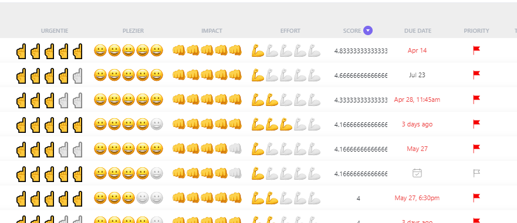
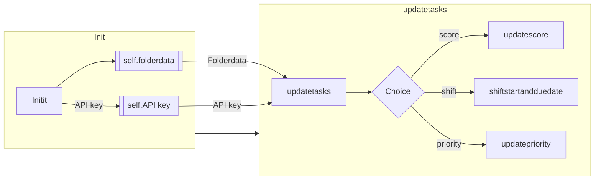
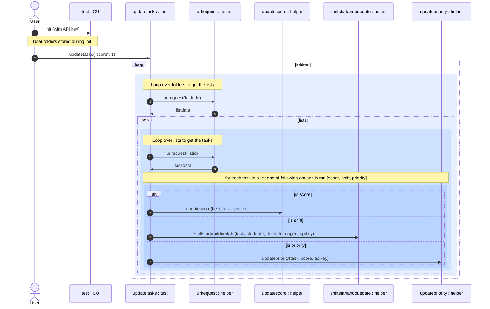

# ClikUpShift


ClickUp is a cloud based project management / ToDo environment. (url: https://clickup.com/?noRedirect=true). 

This Python package adds some functionality that is currently not present. 

It allows you to: 
> * shift tasks (by a number of days),
> * score tasks (by using 4 custom fields), 
> * based on the score give them a priority. 
 

Reference to those custom fields have been hard coded. Therefore, scoring will not work out of the box, shifting tasks should work.

When you add the following fields the code could work, although the field references have been [hard coded](https://github.com/stevedep/ClickUpShiftScore/blob/4b2925c388e3eb26a6fdc039b0eee50dfd79ee0a/ClickUpShiftScore/core.py#L45).
<!--- # --->


## Install

`pip install ClickUpShiftScore`

## How to use

Load the module and add your API code when you create an instance of `CU`. 


```python
from ClickUpShiftScore.core import *


test = CU("pk_42327425_CWKU0F6UMM3Q62KMJ6UDG0BL1RE20AFA")


test.updatetasks("score", 1)
```

    Achter computer of buro
    score updated for: 
    Keizer of divino boeken 
    score updated for: 
    trouw opzeggen
    Huis
    score updated for: 
    koffie kalk
    Op pad / Naar Winkel
    Gezinsplanning
    Projecten
    

```python
test.updatetasks("priority", 10)
```

    Achter computer of buro
    prio updated for: 
    Keizer of divino boeken 
    prio updated for: 
    trouw opzeggen
    prio updated for: 
    Python webscrape magister
    prio updated for: 
    Python Development
    prio updated for: 
    Outlander naar garage voor regulier onderhoud 
    prio updated for: 
    chrores up
    prio updated for: 
    proces gele doekjes
    prio updated for: 
    Planning Simon in deze tool
    Huis
    prio updated for: 
    koffie kalk
    prio updated for: 
    Fix hue
    prio updated for: 
    deurdempers
    prio updated for: 
    messen wisselen
    Op pad / Naar Winkel
    Gezinsplanning
    prio updated for: 
    vakantie plannen
    Projecten
    prio updated for: 
    pyton code in mapjes
    

```python
test.updatetasks("shift", 7)
```

    Achter computer of buro
    int() argument must be a string, a bytes-like object or a number, not 'NoneType'
    Keizer of divino boeken 
    int() argument must be a string, a bytes-like object or a number, not 'NoneType'
    trouw opzeggen
    int() argument must be a string, a bytes-like object or a number, not 'NoneType'
    Python webscrape magister
    int() argument must be a string, a bytes-like object or a number, not 'NoneType'
    Python Development
    int() argument must be a string, a bytes-like object or a number, not 'NoneType'
    Outlander naar garage voor regulier onderhoud 
    int() argument must be a string, a bytes-like object or a number, not 'NoneType'
    proces gele doekjes
    int() argument must be a string, a bytes-like object or a number, not 'NoneType'
    Dempers
    int() argument must be a string, a bytes-like object or a number, not 'NoneType'
    QR codes onderhoud
    int() argument must be a string, a bytes-like object or a number, not 'NoneType'
    hor evi
    int() argument must be a string, a bytes-like object or a number, not 'NoneType'
    tennis tournoeien
    int() argument must be a string, a bytes-like object or a number, not 'NoneType'
    contributie tennis
    int() argument must be a string, a bytes-like object or a number, not 'NoneType'
    Markt in agenda
    int() argument must be a string, a bytes-like object or a number, not 'NoneType'
    pinpas zakelijk
    int() argument must be a string, a bytes-like object or a number, not 'NoneType'
    Garantie stofzuiger
    Huis
    int() argument must be a string, a bytes-like object or a number, not 'NoneType'
    Bed pepijn maken
    int() argument must be a string, a bytes-like object or a number, not 'NoneType'
    koffie kalk
    int() argument must be a string, a bytes-like object or a number, not 'NoneType'
    Fix hue
    int() argument must be a string, a bytes-like object or a number, not 'NoneType'
    deurdempers
    int() argument must be a string, a bytes-like object or a number, not 'NoneType'
    bewarkings cameras
    int() argument must be a string, a bytes-like object or a number, not 'NoneType'
    grasmaaier huisje
    int() argument must be a string, a bytes-like object or a number, not 'NoneType'
    onkruid
    Op pad / Naar Winkel
    Gezinsplanning
    Projecten
    int() argument must be a string, a bytes-like object or a number, not 'NoneType'
    spotifyapi backup
    

# Documentation


Please view *[this documentation](https://StevedeP.github.io/ClickUpShiftScore)* to see the documentation for all modules and functions. 





