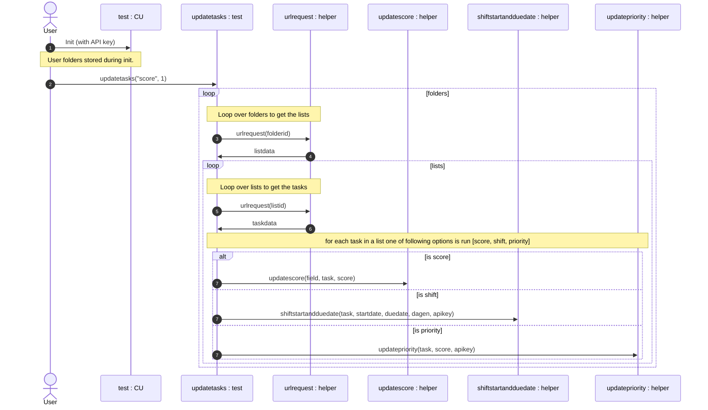

# ClikUpShift
> Package that allows you to shift tasks and to score them. Scoring does require custom fields. Reference to those custom fields have been hard coded. Therefore, scoring will not work out of the box, shifting tasks should work.


## Install

`pip install ClickUpShift`

## How to use

Load the module and add your API code when you create an instance of `CU`. 


```python
from ClickUpShift.core import *


test = CU("pk_42327425_NPYWMF9GG6AQY7OZF36QRXL8XXXS65J7")


test.updatetasks("score", 1)
```

```python
from pkg_resources import parse_version
from configparser import ConfigParser

# note: all settings are in settings.ini; edit there, not here
config = ConfigParser(delimiters=['='])
config.read('settings.ini')
cfg = config['DEFAULT']

name = cfg['lib_name']
user = cfg['user']


from IPython.display import display, Markdown, Latex
display(Markdown('Please view *[this documentation](https://github.com/' + user + '/' + name + ')* to see the documentation for all modules and functions. '  ))

```


Please view *[this documentation](https://github.com/StevedeP/ClickUpShiftScore)* to see the documentation for all modules and functions. 




