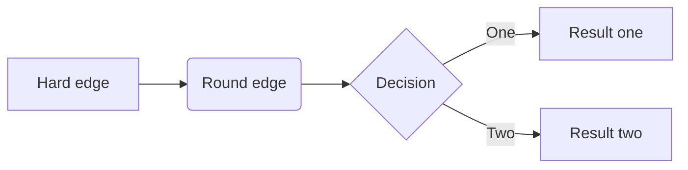

# ClikUpShift
> Package that allows you to shift tasks and to score them. Scoring does require custom fields. Reference to those custom fields have been hard coded. Therefore, scoring will not work out of the box, shifting tasks should work.




```python
from nbdev.export2html import *
```

```python
make_readme()
```

    converting C:\Users\310267217\Python Development\ClickUpShiftScore\index.ipynb to README.md
    

## Install

`pip install ClickUpShift`

## How to use

Load the module and add your API code.


```python
#reset the console and test import, niet te snel, even wachten...
from ClickUpShift.core import *


test = CU("pk_42327425_NPYWMF9GG6AQY7OZF36QRXL8XXXS65J7")


test.updatetasks("score", 1)
```

    Achter computer of buro
    'value'
    Python webscrape magister
    'value'
    Python Development
    'value'
    Feestje pepijn
    'value'
    Outlander naar garage voor regulier onderhoud 
    'value'
    datumprikker BBQ
    'value'
    xbox beperken
    score updated for: 
    chrores up
    score updated for: 
    proces gele doekjes
    score updated for: 
    Verjaardag Pepijn
    


    ---------------------------------------------------------------------------

    KeyboardInterrupt                         Traceback (most recent call last)

    <ipython-input-2-e1ae559d796b> in <module>
          7 
          8 #hide
    ----> 9 test.updatetasks("score", 1)
    

    ~\Python Development\ClickUpShift\ClickUpShift\core.py in updatetasks(self, keuze, dagen)
         26             for list in listdata["lists"]:
         27                 listid = list["id"]
    ---> 28                 taskdata = h.urlrequest("https://api.clickup.com/api/v2/list/" + listid + "/task", self.apikey)
         29                 for task in taskdata["tasks"]:
         30 
    

    ~\Python Development\ClickUpShift\ClickUpShift\helper.py in urlrequest(url, apikey, param)
         15     req = urllib.request.Request(url)
         16     req.add_header("Authorization", apikey)
    ---> 17     resp = urllib.request.urlopen(req, timeout=200)
         18     responsedata = resp.read()
         19     data = json.loads(responsedata)
    

    ~\Anaconda3\lib\urllib\request.py in urlopen(url, data, timeout, cafile, capath, cadefault, context)
        220     else:
        221         opener = _opener
    --> 222     return opener.open(url, data, timeout)
        223 
        224 def install_opener(opener):
    

    ~\Anaconda3\lib\urllib\request.py in open(self, fullurl, data, timeout)
        523 
        524         sys.audit('urllib.Request', req.full_url, req.data, req.headers, req.get_method())
    --> 525         response = self._open(req, data)
        526 
        527         # post-process response
    

    ~\Anaconda3\lib\urllib\request.py in _open(self, req, data)
        540 
        541         protocol = req.type
    --> 542         result = self._call_chain(self.handle_open, protocol, protocol +
        543                                   '_open', req)
        544         if result:
    

    ~\Anaconda3\lib\urllib\request.py in _call_chain(self, chain, kind, meth_name, *args)
        500         for handler in handlers:
        501             func = getattr(handler, meth_name)
    --> 502             result = func(*args)
        503             if result is not None:
        504                 return result
    

    ~\Anaconda3\lib\urllib\request.py in https_open(self, req)
       1391 
       1392         def https_open(self, req):
    -> 1393             return self.do_open(http.client.HTTPSConnection, req,
       1394                 context=self._context, check_hostname=self._check_hostname)
       1395 
    

    ~\Anaconda3\lib\urllib\request.py in do_open(self, http_class, req, **http_conn_args)
       1352             except OSError as err: # timeout error
       1353                 raise URLError(err)
    -> 1354             r = h.getresponse()
       1355         except:
       1356             h.close()
    

    ~\Anaconda3\lib\http\client.py in getresponse(self)
       1345         try:
       1346             try:
    -> 1347                 response.begin()
       1348             except ConnectionError:
       1349                 self.close()
    

    ~\Anaconda3\lib\http\client.py in begin(self)
        305         # read until we get a non-100 response
        306         while True:
    --> 307             version, status, reason = self._read_status()
        308             if status != CONTINUE:
        309                 break
    

    ~\Anaconda3\lib\http\client.py in _read_status(self)
        266 
        267     def _read_status(self):
    --> 268         line = str(self.fp.readline(_MAXLINE + 1), "iso-8859-1")
        269         if len(line) > _MAXLINE:
        270             raise LineTooLong("status line")
    

    ~\Anaconda3\lib\socket.py in readinto(self, b)
        667         while True:
        668             try:
    --> 669                 return self._sock.recv_into(b)
        670             except timeout:
        671                 self._timeout_occurred = True
    

    ~\Anaconda3\lib\ssl.py in recv_into(self, buffer, nbytes, flags)
       1239                   "non-zero flags not allowed in calls to recv_into() on %s" %
       1240                   self.__class__)
    -> 1241             return self.read(nbytes, buffer)
       1242         else:
       1243             return super().recv_into(buffer, nbytes, flags)
    

    ~\Anaconda3\lib\ssl.py in read(self, len, buffer)
       1097         try:
       1098             if buffer is not None:
    -> 1099                 return self._sslobj.read(len, buffer)
       1100             else:
       1101                 return self._sslobj.read(len)
    

    KeyboardInterrupt: 


`CU`

`core`

`helper`

`updatetasks`

.....

